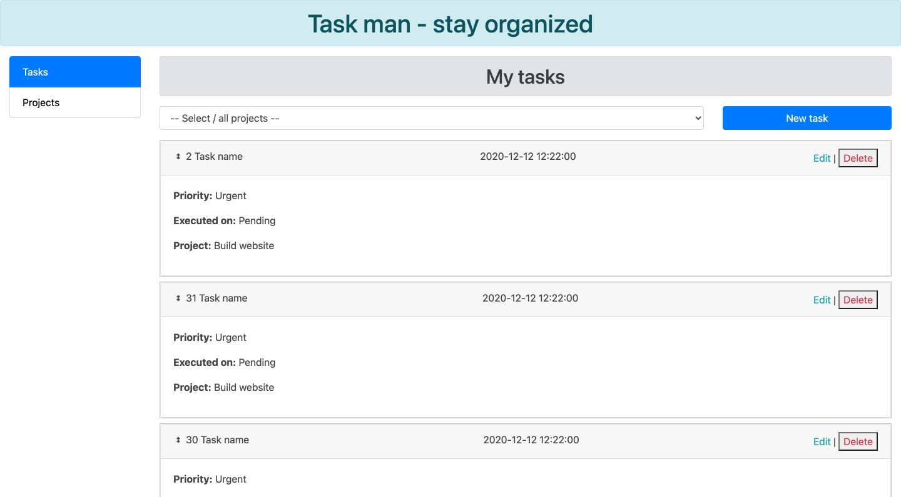
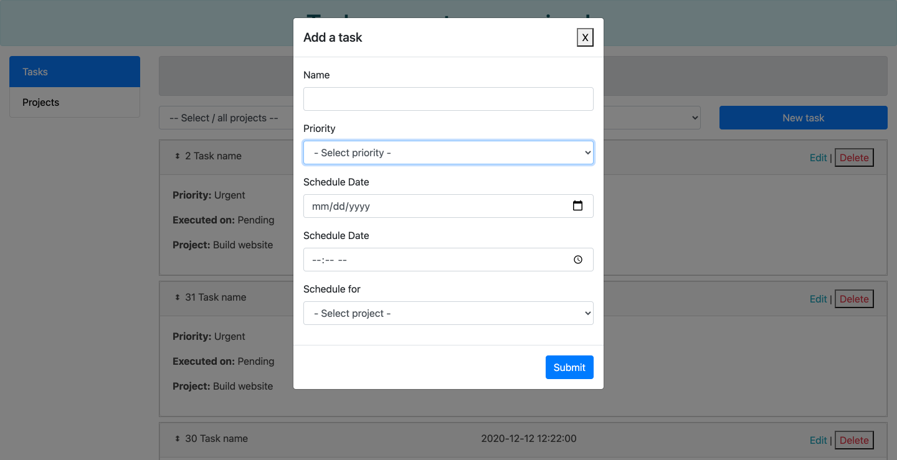
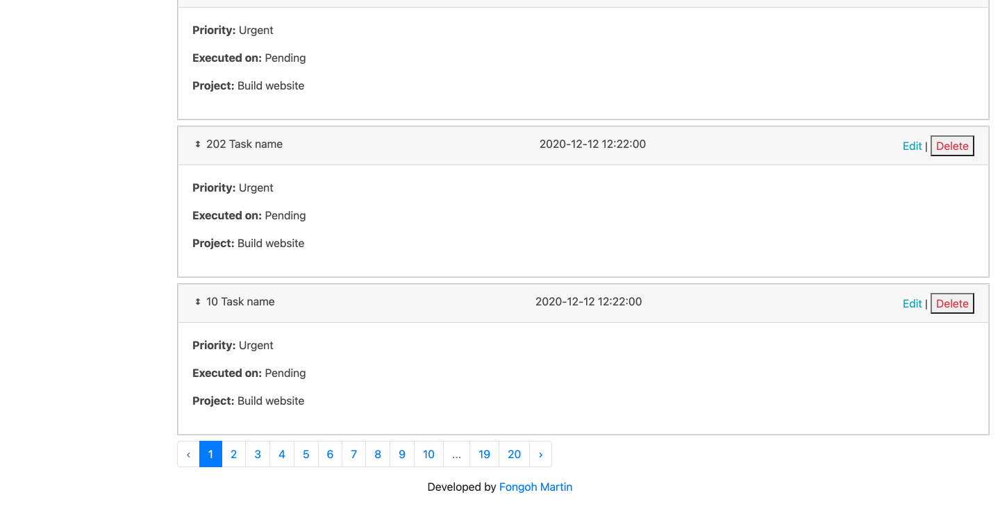
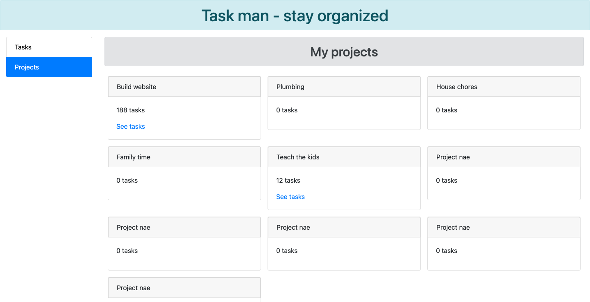

# Task man

## About
Basic application to manage tasks. 

## Screenshots

- Home page (list of tasks)

- Create new task (modal)

- Task footer with pagination

- List of projects and the various tasks under the projects

## Features
With taskman, you can 
- List all tasks (paginated)
- Filter tasks by project
- Reorder tasks (by drag and drop)
- Edit task
- Delete task
- View list of projects

## Tests
Some few test cases were covered for the app, you can check the tests folder

## How to run
1. Clone the repo
2. Setup database
3. Update database config in `.env` file by `cp .env.example .env`
4. Run `php artisan config:cache` to load config changes
5. Run `php artisan migrate` to migrate database
6. Run `php artisan db:seed` to seed dummy data to database
7. Run `php artisan test` to verify and ensure all tests passed
8. Run `php artisan serve` to serve the project and open on http://localhost:8000

## Contribution and issue report
Interested in contributing? Just fork the repo, make your commits and do a PR. 
If you find any bug or need a new feature, feel free to open up a new issue in the issue tracker section of this repo.

## Developer
Done by Fongoh Martin, fongohmartin@gmail.com